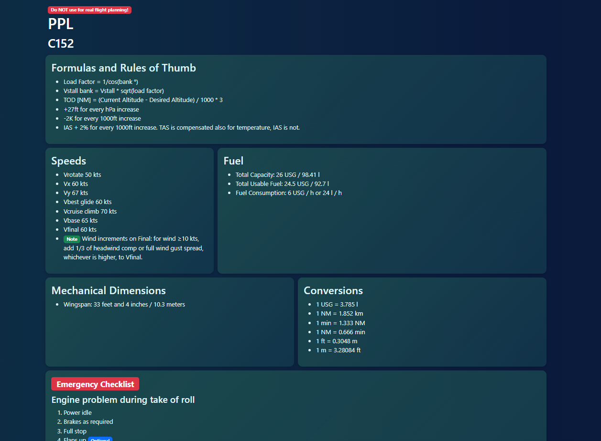

# ppl
Collection of infos, checks and procedures for flying VFR with a small plane

# DO NOT USE FOR REAL FLIGHT PLANNING AND FLYING
This is only for educational purpose, always stick to your local regulations and AFM!

